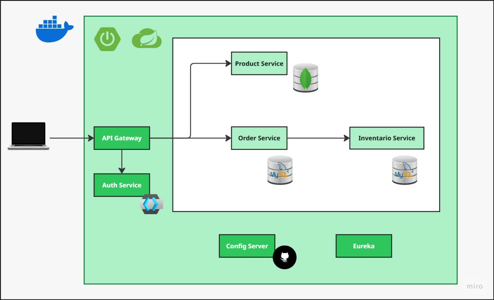

# Order Management System
Order Management System is a hand-ons project covers Spring Cloud foundations about microservice architecture, where I apply diverse technologies such as Docker, Keycloak, JWT and more.

## Proposed Architecture

    

